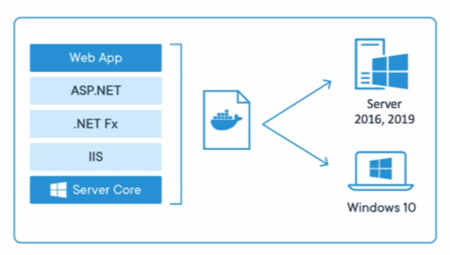

# Docker Images

  


Una imagen de Docker es una plantilla que sirve para crear contenedores.

La imagen contiene todo lo necesario para ejecutar una aplicación, por ejemplo:

- sistema base
- dependencias
- librerías
- archivos de configuración
- software
- código de la aplicación

Una imagen no es lo mismo que un contenedor.

La imagen es la plantilla.  
El contenedor es la imagen ejecutándose.

---

## Imagen vs Contenedor

| Concepto | Explicación |
|---|---|
| Imagen | Plantilla de solo lectura |
| Contenedor | Instancia en ejecución de una imagen |
| Dockerfile | Archivo usado para construir una imagen |
| Docker Hub | Registro donde se descargan imágenes |

Ejemplo:

```text
Imagen nginx  →  contenedor web-1
Imagen nginx  →  contenedor web-2
Imagen nginx  →  contenedor web-3
```

Con una sola imagen puedo crear varios contenedores diferentes.

---

## Versiones de imágenes

Las imágenes pueden tener versiones usando tags.

Ejemplo:

```bash
docker pull nginx:latest
docker pull nginx:alpine
docker pull ubuntu:22.04
docker pull mysql:8.0
```

El tag va después de los dos puntos:

```text
nombre:tag
```

Ejemplo:

```text
ubuntu:22.04
nginx:alpine
mysql:8.0
```

Si no se indica un tag, Docker usa por defecto:

```text
latest
```

---

## Ver imágenes descargadas

```bash
docker images
```

También se puede usar:

```bash
docker image ls
```

Este comando muestra las imágenes que tengo en mi máquina.

---

## Buscar imágenes en Docker Hub

```bash
docker search ubuntu
```

Este comando busca imágenes disponibles en Docker Hub desde la terminal.

También se pueden buscar desde la web de Docker Hub.

---

## Descargar una imagen

```bash
docker pull ubuntu
```

También puedo descargar una versión específica:

```bash
docker pull ubuntu:22.04
```

---

## Ejecutar una imagen

```bash
docker run ubuntu
```

Esto crea un contenedor a partir de la imagen `ubuntu`.

Pero si el contenedor no tiene un proceso activo, se cerrará rápidamente.

Por eso, para entrar a Ubuntu de forma interactiva se usa:

```bash
docker run -it ubuntu bash
```

Significado:

```text
-i  → modo interactivo
-t  → asigna una terminal
bash → abre una shell dentro del contenedor
```

---

## Crear varios contenedores desde una imagen

Una misma imagen puede crear varios contenedores.

Ejemplo:

```bash
docker run -d --name web1 nginx
docker run -d --name web2 nginx
docker run -d --name web3 nginx
```

Todos usan la imagen `nginx`, pero cada contenedor tiene su propio nombre, ID y estado.

---

## Ver contenedores creados

```bash
docker ps
```

Ver solo contenedores activos.

```bash
docker ps -a
```

Ver todos los contenedores, incluidos los detenidos.

---

## Eliminar una imagen

```bash
docker rmi ubuntu
```

También se puede eliminar por ID:

```bash
docker rmi IMAGE_ID
```

Si la imagen está siendo usada por un contenedor, primero debo eliminar el contenedor.

---

## Eliminar todas las imágenes

```bash
docker rmi $(docker images -aq) -f
```

Este comando elimina todas las imágenes de forma forzada.

Usar con cuidado.

---

## Resumen rápido

| Comando | Función |
|---|---|
| `docker images` | Ver imágenes descargadas |
| `docker image ls` | Ver imágenes descargadas |
| `docker search ubuntu` | Buscar imagen en Docker Hub |
| `docker pull ubuntu` | Descargar imagen |
| `docker pull ubuntu:22.04` | Descargar una versión específica |
| `docker run ubuntu` | Crear contenedor desde imagen |
| `docker run -it ubuntu bash` | Entrar a Ubuntu interactivo |
| `docker rmi ubuntu` | Eliminar imagen |
| `docker rmi $(docker images -aq) -f` | Eliminar todas las imágenes |

---

## Nota personal

Una imagen es como una plantilla o molde.

Un contenedor es una copia ejecutándose de esa plantilla.

Si entiendo bien esta diferencia, Docker se vuelve mucho más fácil.
